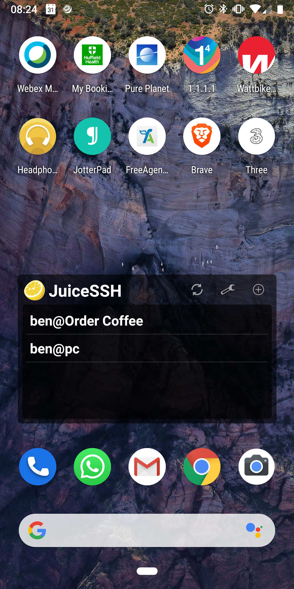
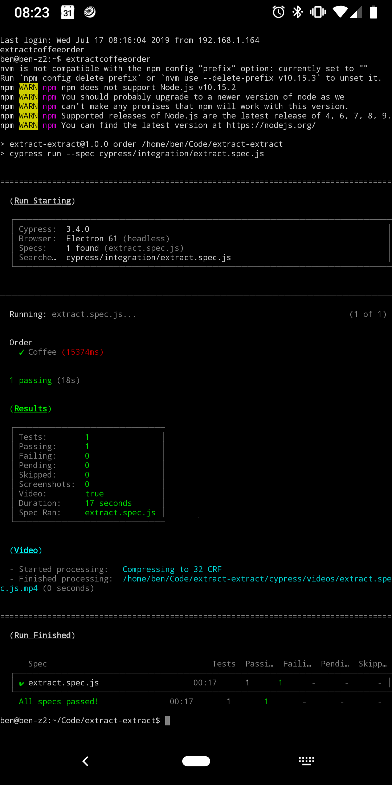

### Order coffee from the CLI.

### Easier than a subscription.

# Background

I've had a weekly subscription to extract coffee for many moons now, however a problem I've had with this, and with all time-based subscriptions is that consumption of those products is never consistent over time. You either end up with a cupboard full of it, or run out all the time.

There are some cool ideas in this space, e.g. https://www.bottomless.com/, however they're in beta and I don't really want hardware for all of these things.

I'd love for there to be a simpler approach. Boiling the problem down, there needs to be some condition which triggers a buy signal. In a traditional subscription that's a time based buy signal, for bottomless, it's a weight threshold.

I've made extract-extract so that the buy signal can be me either realising I'm low on coffee, or need to order extra.

This is really just a proof-of-concept project! I'm trying it out for a while, to see if it works better for me.

# Extract-Extract

This mini-project is actually just a single cypress integration test, partly because I wanted to start using cypress more, and partly because in previous projects I've done like this, I've found being able to assert success at each step to be very helpful.

It's configured with a few environment variables.

Currently I'm set up to order coffee from a widget on my phone as a 1-click (no longer under patent from amazon), which is easy enough to do when I am waiting for my aeropress to steep.

## Installation
I've not packaged this up as an NPM package at the moment because it's just an experiment, however you can just clone this repo and run `npm i` from that dir to get going.

Requires a modernish version of node.js. I used 10.15 because I had it already.

## Configuring

You'll need a pre-existing extract coffee account, with a valid credit-card associated for this script to work.

Steps:

1. Copy the `cypress.json` file to `cypress.env.json`:
```
cp cypress.json cypress.env.json
```

2. Add your user credentials to `cypress.env.json` under username/password.

3. Copy paste the URL of the product you want to order, e.g. `https://extractcoffee.co.uk/shop/coffee/cast-iron-espresso/`

4. For the `grindType` setting, set to one of the following fairly self-explanatory values:
- `whole-bean`
- `espresso-ground`
- `cafetiere-ground`
- `filter-ground`

5. The quantity is not configurable - extract-extract isn't really for bulk ordering!

6. There's a `dryRun` variable I've added which does everything other than clicking pay at the end of the checkout. Leave this as `true` until you're really sure the right stuff is in your basket with the right details.

Now you can run `npm run order` to order coffee, or `npm run open` to open up the cypress GUI, which is nice for seeing the magic.

You should see something including:

```
Running: extract.spec.js...                                                 (1 of 1)


  Order
    ✓ Coffee (13929ms)
```

## How I use this

1. I've got a bash alias in `.bashrc`:

```bash
alias extractcoffeeorder="cd Code/extract-extract; nvm use 10.15; npm run order"
```

2. I am using juiceSSH from my android phone to connect and run that command on a click:



3. When running the command, it's not really fair to say it comes with a user friendly output, however the Cypress output make it clear if it worked or not:




## Disclaimer
It's not my fault if you order 17 bags of coffee when you're testing this. The script also accepts the T&Cs for you, so be sure you're happy with that.
